<!-- Please do not change this logo with link -->

# USB Human Interface Device (HID) Communication Demo Using On-Board Button
This example shows how the HID class can be used on an AVR DU microcontroller with the AVR64DU32 Curiosity Nano Board to simulate a set of key-presses by pushing the physical button on the Curiosity Nano Board.

## Related Documentation
- [AVR® DU Family Product Page](https://www.microchip.com/en-us/products/microcontrollers-and-microprocessors/8-bit-mcus/avr-mcus/avr-du)

### USB Specifications

- [USB Human Interface Device (HID) Specification](https://www.usb.org/document-library/device-class-definition-hid-111)
- [Device Class Definition for HID 1.11](https://usb.org/document-library/hid-usage-tables-15)
- [USB 2.0 Specification](https://www.usb.org/document-library/usb-20-specification)

## Software Used

- MPLAB® X IDE 6.20.0 or newer [(MPLAB® X IDE 6.20)](https://www.microchip.com/en-us/development-tools-tools-and-software/mplab-x-ide?utm_source=GitHub&utm_medium=TextLink&utm_campaign=MCU8_MMTCha_MPAE_Examples&utm_content=avr64du32-cnano-usb-hid-keyboard-mplab-mcc-github)
- MPLAB® XC8 2.46.0 or newer compiler [(MPLAB® XC8 2.46)](https://www.microchip.com/en-us/development-tools-tools-and-software/mplab-xc-compilers?utm_source=GitHub&utm_medium=TextLink&utm_campaign=MCU8_MMTCha_MPAE_Examples&utm_content=avr64du32-cnano-usb-hid-keyboard-mplab-mcc-github)
- MPLAB® Code Configurator (MCC) plugin 5.5.0 or newer [(MPLAB® Code Configurator 5.5.0)](https://www.microchip.com/en-us/tools-resources/configure/mplab-code-configurator)

## Hardware Used

- [AVR64DU32 Curiosity Nano (EV59F82A)](https://www.microchip.com/en-us/development-tool/EV59F82A?utm_source=GitHub&utm_medium=TextLink&utm_campaign=MCU8_AVR-DU&utm_content=avr64du32-keypad-mplab-mcc-github&utm_bu=MCU08)

## Setup

### Physical Setup

The AVR DU Curiosity Nano development board has two USB-C ports. The port labeled "Debugger" is used to program the device with the example code. This port must be connected to the PC when uploading the code to the device. After the programming is done, the cable connected to the "Debugger" port may be disconnected if you wish, but will not affect the example if it remains plugged in. To test the device after code has been uploaded, the port "Target" needs to be connected to the PC while testing.

### MCC Setup

This section shows how the example is set up in MCC.

#### USB General Settings
The configuration is set so that the AVR DU will identify as an HID device on the highest level. The Keyboard protocol is selected to allow the device to mimic a keyboard.

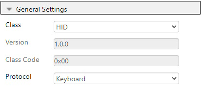

#### USB Device Descriptors
The Device Descriptors can be left as default.

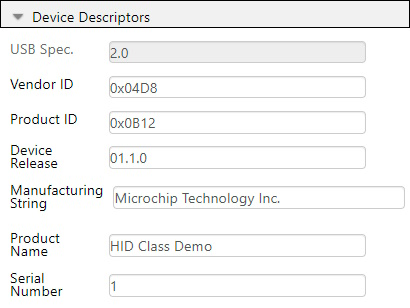

#### USB Interfaces
For this example project, an HID interface is needed. It does not need any modification beyond being added.

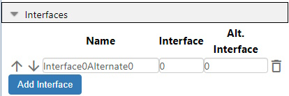

#### USB HID Interface
The interface created in the last step does not need any modification, and is best left to default.

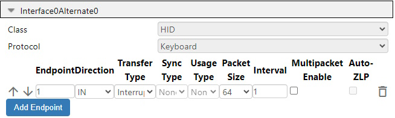

### Device Clock Setup
This example is configured to run on 12MHz. The minimum oscillator frequency available for USB on the AVR DU is 12MHz.

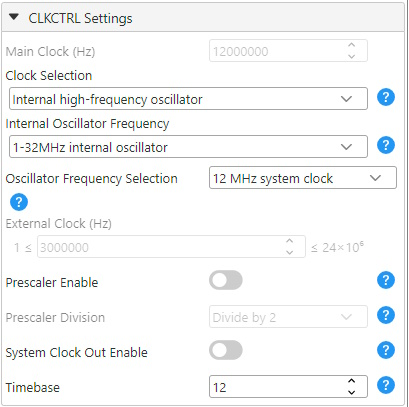

### Device Pin-out Setup
Three pins are used for this example, with VBUS on PC3 set as input with "Digital Input Buffer disabled", SW0 on PF6 set to input with "Sense Falling Edge", and LED0 on PF2 set to output with "Interrupt disabled but input buffer enabled".

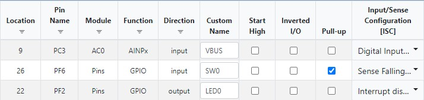

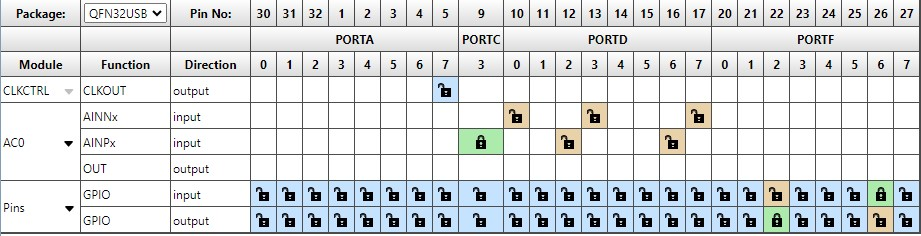

### USB Voltage Detection Setup
To ensure that the USB peripheral only tries to attach to the bus when plugging in the Curiosity Nano to the PC, the Analog Comparator will periodically check if the voltage is within the acceptable range for VBUS.

#### Voltage Reference Setup
The Voltage Reference is set to 2.048V.

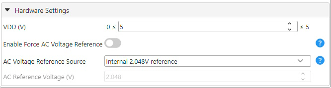

#### Analog Comparator Setup

##### Analog Comparator Control A Settings
Under this register, the AC must be enabled by enabling bit 0.

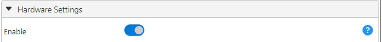

##### Analog Comparator DAC Reference Settings
The DACREF register must be set to a value that can detect the correct voltage level at minimum 0,4V. Refer to the [AVR64DU32 Curiosity Nano User Guide](https://ww1.microchip.com/downloads/aemDocuments/documents/MCU08/ProductDocuments/UserGuides/AVR64DU32-Curiosity-Nano-UserGuide-DS50003671.pdf) to find the values for the voltage divider on Pin PC3. The DACREF value of 40 used in this project is a bit below the required DACREF value to detect 0,4V, and was selected to have some extra detection tolerance.

##### Analog Comparator MUX Control Settings
To measure the correct values, the positive input must be connected to AINP4, While the negative input is set to the reference pin of the analog comparator.

#### Real-Time Counter Setup

##### Real-Time Counter Period Settings
On the Hardware settings, the "Enable RTC" can be disabled (Enabled by default), and note down the RTC Clock Source Selection, as it will impact the Period Selection value needed for the Periodic Interrupt Timer.

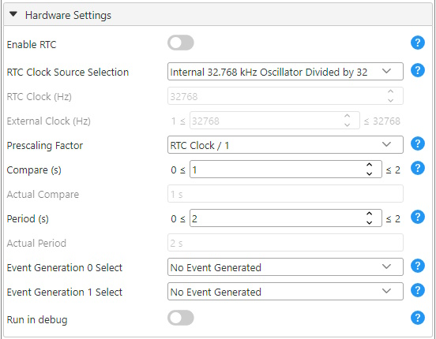

##### Real-Time Counter Periodic Interrupt Control Settings
The Periodic Interrupt Timer is enabled for this example, and the period selection is set to RTC Clock Cycles 1024. This value must be changed according to the clock source selection.

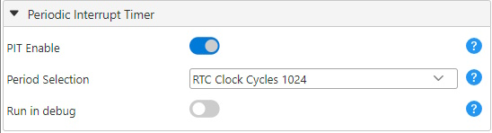

##### Real-Time Counter Periodic Interrupt Interrupt Control Settings
The Periodic Interrupt Timer's Interrupt Flag is also enabled to allow for an interrupt routine.

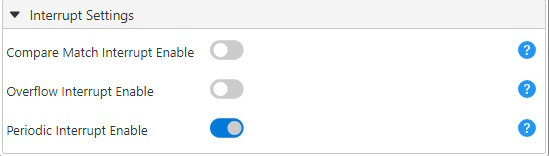

## Operation

This example can be tested by following these steps:

1. Upload code by connecting the hardware as explained in "Physical Setup".
2. Connect the PC to the "Target" plug on the Curiosity Nano Board by using a USB-C cable.
3. Open any program that allows for text input, and press the button "SW0-PF6" on the Curiosity Nano-board.

## Summary

This example has shown how the USB HID class can be used on an AVR DU to simulate a set of key-presses using only the on-board button on the Curiosity Nano kit.
